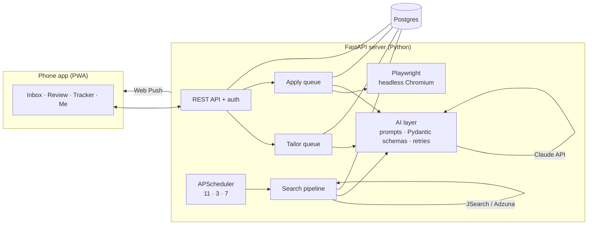

# Upajna - Job Application Assistant

## Why I built this

I'm a Business Analyst with 6+ years of experience across banking, healthcare and cloud infrastructure, finishing my Master's in Computer Science. When I started job hunting, I learned what everyone learns: the search itself becomes a full-time job.

Every good posting meant the same routine. I read the description, checked whether I was even eligible, making adjustments to my resume to match its wording so an ATS wouldn't filter me out, wrote a cover letter, and then typed the same answers into another application form. Repeat that for every posting across LinkedIn, Indeed, Dice and ZipRecruiter, and there's little time left for the things that actually get you hired: networking, preparing for interviews, and learning.

As a Business Analyst, my job is to look at a slow, repetitive process and redesign it. So I treated my own job search like a client project. I mapped the as-is process, found the steps that were pure repetition, and asked which of them an LLM could do well and which still needed a human. The result is Upajna.

**Upajna does the repetitive work, and I make the decisions.** It finds new postings three times a day, filters out the ones I'm not eligible for, and ranks the rest against my resume. It tailors my resume, cover letter and answers for each job I pick. It never invents experience, and it tells me honestly which keywords I'm missing. When I approve, it fills in and submits the application. Nothing is submitted without my review.

## What it does

A phone app backed by a Python server. The server searches job boards three times a day, scores every posting against your resume, and uses Claude to tailor your resume, cover letter and application answers. When you tap **Approve**, a headless browser fills in and submits the application.

### Features

| | |
|---|---|
| 🔎 **Job discovery** | JSearch (LinkedIn, Indeed, ZipRecruiter, Glassdoor, company sites) and Adzuna, 3× a day (11am / 3pm / 7pm PT), anywhere in the US |
| 🚫 **Smart filtering** | Drops postings that don't sponsor visas, are US-citizen / green-card only, or need a clearance (regex rules + LLM check); dedupes the same job across boards |
| 🔗 **Send any job by link** | Paste a LinkedIn, Greenhouse, Lever, Ashby or careers-page link (or use the bookmark button / Android Share menu). Upajna reads that one public page, flags no-sponsorship postings, tells Easy Apply apart from company-site applications, and never signs in to LinkedIn |
| 🧭 **Roles, each with its own resume** | Search several kinds of roles at once (for example Business Analyst, Data Engineer, Software / AI-ML Engineer). Each role has its own job titles and master resume, and every job is scored and tailored from the matching one |
| 📊 **LLM fit scoring** | A fast model scores every job 0–100 against the resume for its role in batches, with a one-line reason |
| ✍️ **Resume tailoring** | Rewrites the summary, skills and bullets in the posting's exact wording for skills you really have, reports an ATS keyword score and missing keywords, and writes a cover letter and application answers |
| 🤖 **Auto-apply** | Playwright reads any Greenhouse / Lever / Ashby form, an LLM maps each field to your approved answers, and it fills, uploads and submits. It stops and asks you on CAPTCHAs, sign-ins, or questions it can't answer truthfully |
| 📱 **Phone app** | Installable PWA with inbox, review, tracker (follow-up reminders) and push notifications |

## Architecture



**Job lifecycle:** `new → tailoring → review → ready → applying → submitted`. Any job that needs a person along the way branches to `needs_you`, and you can `skip` or mark a job `closed`.

### AI design choices

- **Structured outputs, validated.** Every Claude response is parsed and validated against a Pydantic schema (`app/ai/schemas.py`). If the output doesn't fit, the validation error goes back to the model for one corrective retry (`app/ai/client.py`).
- **Prompts as files.** Templates live in `app/ai/prompts/*.md`, separate from code, so they're easy to review and iterate.
- **Two model tiers.** A fast, cheap model scores batches of 15 jobs; a stronger model does the tailoring. Both are configurable.
- **Grounded generation.** The tailoring prompt forbids inventing experience. Requirements you don't show go to `gaps`, and unknown answers come back as `ASK ME:` and block approval until you fill them in.
- **Prompt-injection hygiene.** Job text is marked as untrusted website data in every prompt.
- **Human in the loop.** Nothing is submitted without your approval, and the apply worker stops rather than guessing.

## Tech stack

Python 3.12 · FastAPI · SQLAlchemy 2 (Postgres / SQLite) · Anthropic Claude API · Pydantic v2 · Playwright · APScheduler · python-docx · pypdf · Web Push (VAPID) · vanilla JS PWA · Docker Compose · Caddy · AWS Lightsail · pytest · GitHub Actions

## Project structure

```
app/
  main.py            FastAPI routes, scheduler, static app
  config.py          settings from environment
  db.py              SQLAlchemy models + data access
  auth.py            single-user login (signed cookie)
  workers.py         async tailoring / apply queues
  ai/                client.py, schemas.py, scoring.py, tailoring.py, form_mapping.py, prompts/*.md
  search/            jsearch.py, adzuna.py, filters.py, pipeline.py
  apply/             worker.py (Playwright), collect_fields.js, empty_required.js
  documents.py       Word resume / cover letter, resume parsing
  push.py            phone notifications
static/              the web and phone app (HTML, JS, service worker, manifest)
deploy/              docker-compose.yml, Caddyfile, setup.sh, update.sh, backup.sh
tests/               pytest: API flow, filters, AI parsing/retry, real-browser form filling
```

---

## Deploy it on AWS (about 30 minutes)

Upajna runs on one small Ubuntu server: the app, a Postgres database and [Caddy](https://caddyserver.com) for free automatic HTTPS, all started by Docker Compose (`deploy/`). Full walkthrough with explanations: [docs/system-design/07-deployment.md](docs/system-design/07-deployment.md).

### 1. Get your keys

| What | Where | Needed? |
|---|---|---|
| Claude API key | console.anthropic.com → API Keys | Yes |
| JSearch | rapidapi.com → JSearch → Subscribe → copy **X-RapidAPI-Key** | Optional (scheduled search) |
| Adzuna | developer.adzuna.com → Dashboard | Optional (scheduled search) |

Without job-search keys, Upajna still works with jobs you send by link.

### 2. Create the server (AWS Lightsail)

1. Lightsail → **Create instance** → Linux/Unix → **OS Only → Ubuntu 24.04 LTS** → the **2 GB** plan → name it `upajna`.
2. **Networking → Create static IP** and attach it to `upajna`.
3. On the instance's **Networking** tab, add a firewall rule for **HTTPS (443)**.

(If Lightsail isn't available on your account, an EC2 `t3.small` running Ubuntu 24.04 works the same way: open ports 80 and 443 in its security group and attach an Elastic IP.)

### 3. Run the setup script

On the instance, choose **Connect using SSH** and paste:

```bash
bash <(curl -fsSL https://raw.githubusercontent.com/GnanithaG/Upajna/main/deploy/setup.sh)
```

It installs Docker, asks for your sign-in password and API keys (kept only on the server in `~/upajna/.env`), builds and starts everything, schedules a nightly database backup, and prints your address, e.g. `https://44-55-66-77.sslip.io`.

To update after new code is pushed: `~/upajna/deploy/update.sh`

### 4. On your phone

1. Open the URL and sign in.
2. Add it to your home screen: iPhone **Share → Add to Home Screen**; Android **⋮ → Install app**.
3. In **Settings**:
   - Under **Roles and resumes**, upload a resume for each role you want to search for.
   - Fill in your details: work authorization, sponsorship, salary, start date.
   - Check the search settings.
   - Tap **Turn on notifications**.
4. On **Inbox**, tap **Search now**.

### 5. Turn on real submission

In test mode, approved Greenhouse, Lever and Ashby applications are filled but not submitted, and you get a screenshot in **Tracker**. When a few look right, change `APPLY_SUBMIT=false` to `true` in `~/upajna/.env` on the server and run `~/upajna/deploy/update.sh`.

## Run locally

```bash
python -m venv .venv && source .venv/bin/activate
pip install -r requirements-dev.txt
playwright install chromium
cp .env.example .env        # fill in keys; SQLite is used by default
uvicorn app.main:app --reload
pytest -q                   # runs offline with mocked APIs (set TEST_DATABASE_URL to test on Postgres)
```

## Limits

- LinkedIn and Indeed don't offer personal APIs for applying, and they discourage automation. Those jobs come back to you with everything prepared.
- Adzuna shortens job descriptions. Upajna fetches the full posting before tailoring when the site allows it.
- Application forms vary. The filler reads labels generically, so some forms will need you. Start in test mode.
- API usage (Claude, JSearch) is billed to your own accounts.
