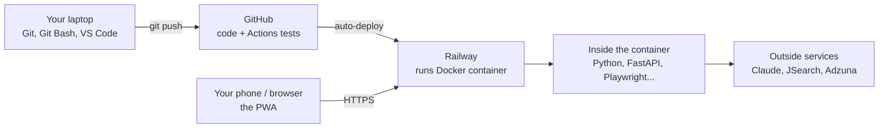

# Step 0: The toolbox

*Upajna system design journal. Every tool in the project: what it is, why it's here, and where you'll meet it.*

Think of the tools in layers, from your keyboard to the internet:

## 1. Where the code lives and travels

| Tool | What it is | How Upajna uses it |
|---|---|---|
| **Git** | Version control: records every change as a "commit" so you can see history and undo mistakes | You commit changes on your laptop, then `git push` |
| **Git Bash** | A terminal for Windows that runs Git and Linux-style commands | Where you typed `git push` |
| **GitHub** | A website that stores Git repositories online | Holds `GnanithaG/Upajna`; Railway pulls code from here |
| **GitHub Actions** | GitHub's robot that runs commands on every push | Runs the 21 tests (`.github/workflows/tests.yml`); the green check means they passed |

## 2. Where the app runs: Railway and Docker

| Tool | What it is | How Upajna uses it |
|---|---|---|
| **Railway** | A cloud hosting service. You give it your code; it runs it on its computers 24/7 and gives you a public web address | Runs the Upajna server and its database, so the app works from anywhere and the 11/3/7 searches happen while your laptop is off |
| **Docker** | Packages the app plus everything it needs (Python, Chromium, libraries) into one "container" image that runs the same everywhere | The `Dockerfile` is the recipe; Railway builds it on each deploy |
| **Environment variables** | Settings given to the app from outside the code | API keys and passwords live in Railway's **Variables** tab, never in GitHub |

**Railway in one sentence:** it's a computer in the cloud that you rent by the hour, with the setup work done for you. The alternatives are Render, Fly.io, Heroku, or a raw server on AWS; Railway is one of the simplest. Its Hobby plan is $5/month and includes $5 of usage; Upajna may cost a bit more because launching Chromium to fill forms uses memory. Check railway.com/pricing for current details.

**Deploy flow:** you `git push` → GitHub stores it → Railway notices, builds the Docker image, starts the new version → your phone gets the update on next open.

## 3. The server (the "backend")

| Tool | What it is | How Upajna uses it |
|---|---|---|
| **Python** | The programming language | All server code in `app/` |
| **FastAPI** | A Python framework for building web APIs | Defines every endpoint (`@api.get("/jobs")`) in `app/main.py`; also auto-generates API docs at `/docs` |
| **Uvicorn** | The web server that runs FastAPI and listens for requests | Started by the `CMD` line in the `Dockerfile` |
| **Pydantic** | Checks that data has the right shape and types | Validates every Claude response (`app/ai/schemas.py`) and API request body |
| **APScheduler** | Runs functions on a timetable | Starts the job search at 11am, 3pm, 7pm |
| **httpx** | Makes HTTP requests from Python | Calls the JSearch and Adzuna APIs |

## 4. Data

| Tool | What it is | How Upajna uses it |
|---|---|---|
| **SQLAlchemy** | Lets Python talk to databases without hand-writing SQL | Tables and queries in `app/db.py` |
| **SQLite** | A database stored in a single file | Used when you run locally (`data/upajna.db`) |
| **PostgreSQL** | A full database server | Used on Railway; survives restarts and redeploys |

Same code, two databases: `DATABASE_URL` decides which one. This is a common pattern: simple locally, robust in production.

## 5. AI and outside data

| Tool | What it is | How Upajna uses it |
|---|---|---|
| **Claude API** (`anthropic` SDK) | Anthropic's API for Claude models; you pay per use | Scores jobs (fast model), tailors resumes and answers (stronger model), maps form fields |
| **JSearch** (via RapidAPI) | A paid API that collects jobs from LinkedIn, Indeed, ZipRecruiter, Glassdoor and company sites | Main job source (`app/search/jsearch.py`) |
| **Adzuna** | A free job-search API | Second job source (`app/search/adzuna.py`) |

## 6. Automation and files

| Tool | What it is | How Upajna uses it |
|---|---|---|
| **Playwright + Chromium** | Controls a real, invisible web browser from code | Opens Greenhouse/Lever/Ashby forms, fills them, uploads your resume, submits (`app/apply/worker.py`) |
| **python-docx** | Creates Word files | Builds your tailored resume and cover letter (`app/documents.py`) |
| **pypdf** | Reads PDF files | Extracts text when you upload a PDF resume |

## 7. The client (the "frontend")

| Tool | What it is | How Upajna uses it |
|---|---|---|
| **HTML, CSS, JavaScript** | The three languages every browser understands: structure, style, behavior | `static/index.html`, `static/style.css`, `static/app.js` |
| **PWA** (Progressive Web App) | A website that can be installed on a phone's home screen and work like an app | `manifest.webmanifest` gives it a name and icon |
| **Service worker** | A script the browser keeps running in the background | `static/sw.js` caches the app for offline use and shows notifications |
| **Web Push + VAPID keys** | The standard way servers send notifications to browsers; VAPID keys prove the messages come from your server | `app/push.py` (with `pywebpush`) sends "12 new jobs to review" |

## 8. Testing

| Tool | What it is | How Upajna uses it |
|---|---|---|
| **pytest** | Python's most popular testing tool | 21 tests in `tests/`: API flow, filters, AI validation, real-browser form filling |
| **Mock mode** (`MOCK_EXTERNAL=true`) | Fake versions of Claude, job APIs and the browser | Lets tests run offline, fast and free |

## Not part of the GitHub project

The first version you used inside Claude (the page with the Inbox, plus the "Upajna job search" and "Upajna apply" scheduled tasks) runs on Claude's own platform. It was the prototype. The GitHub project is the standalone version you own and deploy yourself.
