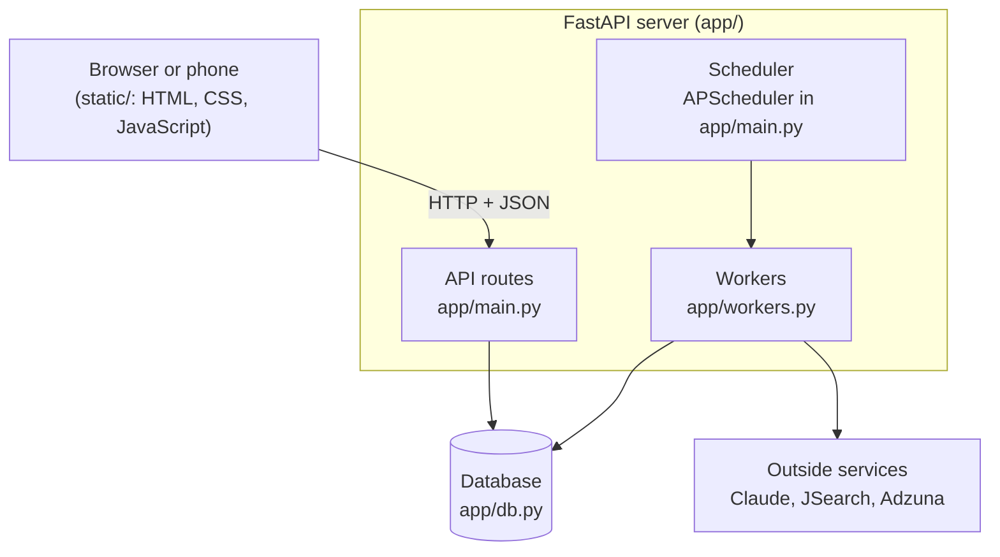

# Step 1: The big picture

*Upajna system design journal. Each step explains one concept, then the part of Upajna it shapes.*

## The concept: client and server

Every web application has two halves.

- **The client** is what runs on your device: the browser (or the phone app, which is a website installed to your home screen). It draws the screens and reacts to taps. It holds almost nothing permanently.
- **The server** is a program running on a computer somewhere else (Railway, for Upajna). It holds the data, the secrets (API keys), and does the heavy or slow work.

They talk through **HTTP requests**: the client sends a request ("give me my jobs"), and the server sends back a response (a list of jobs as JSON). Every button in Upajna turns into one of these requests.

Why split it this way?

1. **Secrets stay safe.** Your Claude API key lives only on the server. If it were in the browser, anyone could read it.
2. **Data lives in one place.** Your phone and laptop both ask the same server, so they always agree.
3. **Work continues when your phone is locked.** Searches at 11am, 3pm and 7pm happen on the server, not on your device.

## Upajna today

| Piece | Where in the code | Job |
|---|---|---|
| Client | `static/index.html`, `static/app.js` | Screens, buttons, calls the API |
| API routes | `app/main.py` (`@api.get`, `@api.post`) | Receive a request, check login, read or change data, respond |
| Workers | `app/workers.py` | Slow jobs (tailoring, applying) that shouldn't make you wait |
| Scheduler | `lifespan()` in `app/main.py` | Starts the search three times a day |
| Database | `app/db.py` | Remembers jobs, settings, resume |
| Outside services | `app/ai/`, `app/search/` | Claude for AI, job boards for listings |

## Tracing one request: tapping "Search now"

Following a single action from tap to result is the best way to understand any system.

1. **Client.** `static/app.js` sends `POST /api/search/run`.
2. **API route.** `search_now()` in `app/main.py` checks you're signed in, then starts the search **in the background** with `asyncio.create_task(...)` and answers immediately: `{"started": true}`. It doesn't wait, because a search takes a minute or more and a request that hangs that long feels broken.
3. **Search pipeline.** `run_search()` in `app/search/pipeline.py` calls the job boards, drops duplicates and postings that don't sponsor, asks Claude to score each job (`score_jobs`), and saves good matches with `db.put_job(...)` as status `new`.
4. **Notification.** It sends a push notification: "12 new jobs to review."
5. **Client again.** Meanwhile, `schedulePoll()` in `app.js` asks `GET /api/jobs` every 4 seconds while something is running, so the new jobs appear on their own.

The pattern in steps 2 to 5 is called **asynchronous processing**: accept the request fast, do the slow work in the background, and let the client check back. You'll see it again in Step 5.

## Key terms

- **Request / response:** one round trip between client and server.
- **Endpoint:** one URL the server answers, like `GET /api/jobs`.
- **JSON:** the text format the client and server use to exchange data.
- **Stateless client:** the browser keeps no important data; refresh it and nothing is lost.
- **Background task:** work that continues after the response has been sent.

## Roadmap

1. **The big picture:** client, server, request flow *(this step)*
2. **Frontend for the web:** responsive design, one codebase for phone and laptop
3. **The API contract:** REST endpoints and the auto-generated docs
4. **Data modeling:** tables, job statuses as a state machine, planning for multiple users
5. **Background work:** queues, workers, scheduling
6. **Authentication:** sessions and cookies, and the path to user accounts
7. **Deployment:** Docker, environments, configuration and secrets
8. **Reliability and scale:** what breaks with many users, and how to see it
9. **Going multi-user:** putting it all together
