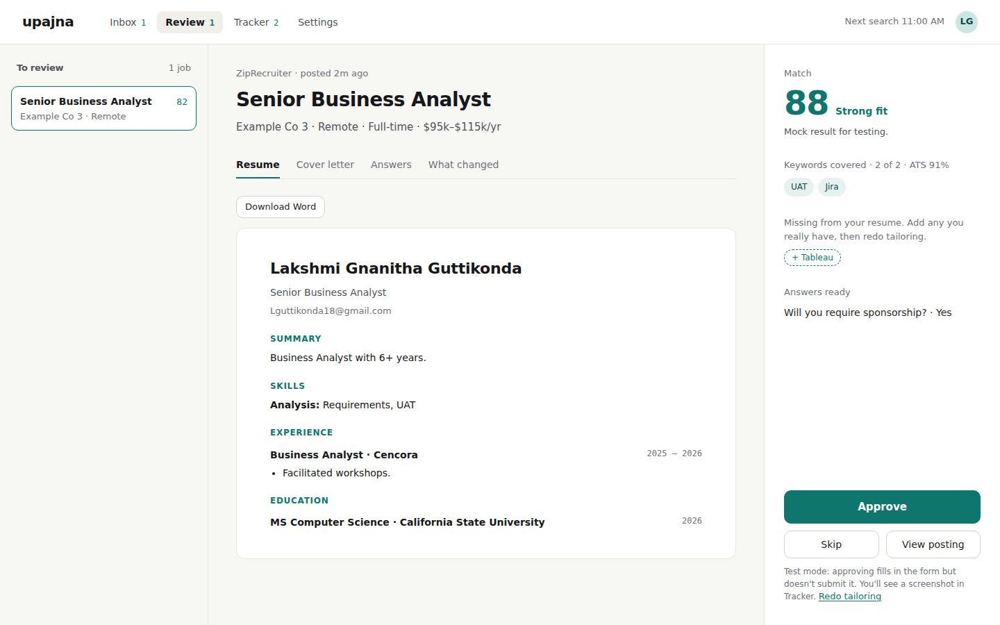
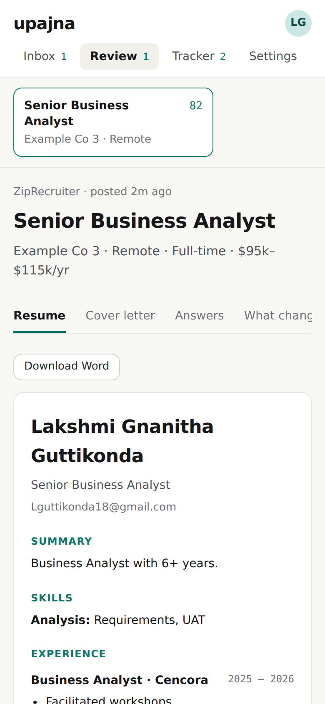
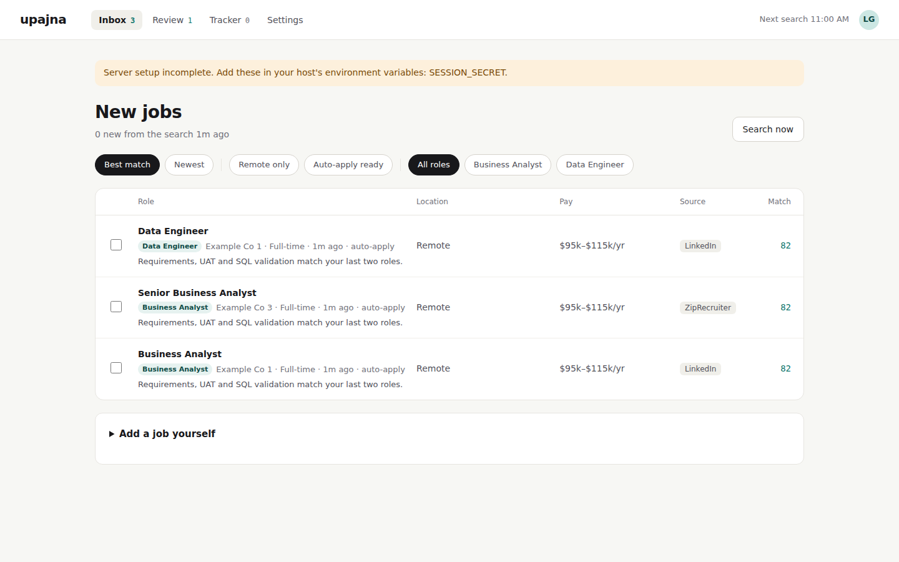
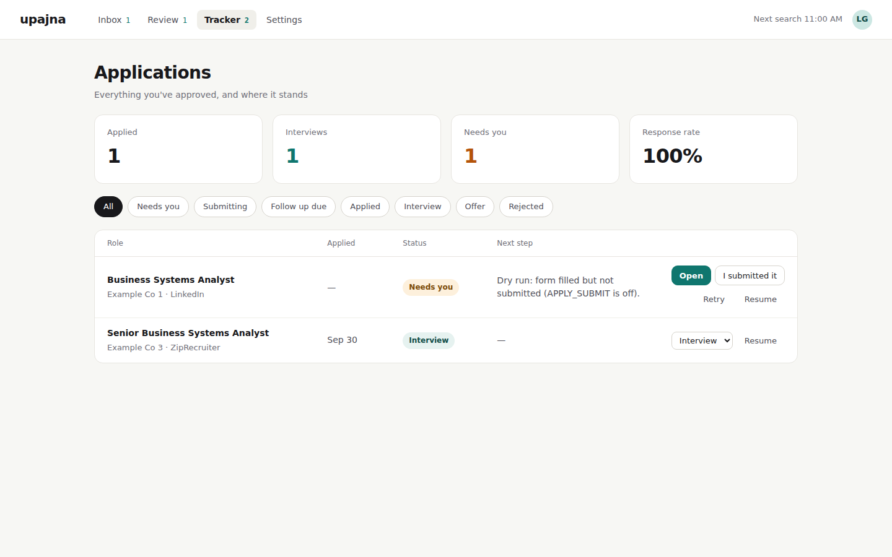
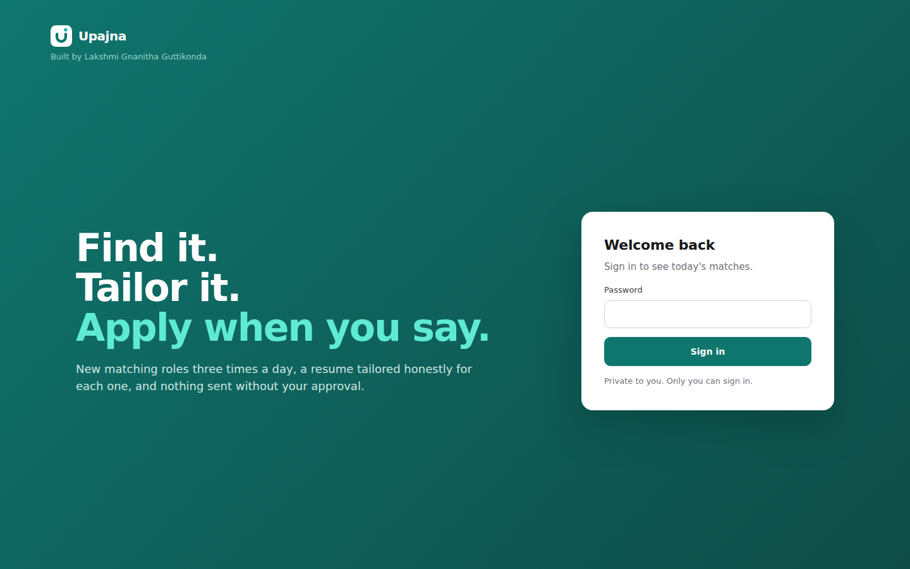

# Step 2: Frontend for the web (responsive design)

*Upajna system design journal.*

## The concept: one codebase, many screens

You could build a separate website for laptops and a separate app for phones. Many companies used to. The problem: two codebases means every feature gets built twice, and they drift apart.

**Responsive design** is the alternative: one set of HTML and JavaScript, and CSS that rearranges the layout depending on screen width. The browser checks the width and applies different rules.

The tool for this is a CSS **media query**:

```css
/* Applies only when the screen is at least 1024px wide */
@media (min-width: 1024px) {
  .tabs { flex-direction: column; }   /* tabs stack vertically into a sidebar */
}
```

The width where the layout changes is called a **breakpoint**. Upajna uses two:

| Width | Typical device | Layout |
|---|---|---|
| under 1024px | phones, tablets | tabs under the logo; tables turn into stacked cards; Review stacks list, resume, decision |
| 1024px and up | laptops | top navigation; Inbox and Tracker as tables; Review in three columns |

This approach is called **mobile-first**: the phone layout is the default, and wider screens add rules on top. Phones download the least and get the simplest layout.

## What changed in Upajna

The first attempt (a sidebar version of the old phone app) didn't work: it looked dated, cluttered, and the layout felt wrong. So we did what product teams do: **explored directions before building**. Three mockups (Calm workspace, Pipeline board, Focus mode), then variations of the winner, then four color palettes. The chosen design is **Calm workspace in teal**.

| Laptop: Review | Phone: Review |
|---|---|
|  |  |

| Inbox | Tracker |
|---|---|
|  |  |

1. **Top navigation** instead of a sidebar, so content gets the full width.
2. **Review in three columns:** the list of jobs (scan), the tailored resume (read), and a decision rail with the match score, keywords, answers and the **Approve** button (decide). Each column has one job.
3. **Inbox and Tracker as tables.** Many similar items with the same fields is exactly what tables are for: your eye runs down a column to compare match scores or statuses.
4. **On phones** the same HTML rearranges: tables become stacked cards, and Review stacks list, resume and decision vertically.
5. **Sign-in page:** the first version looked empty, the second (a split screen with steps and a sample card) felt off. Three more mockups later, the winner is a **bold teal page**: one headline ("Find it. Tailor it. Apply when you say.") and a single white sign-in card. One message, one action.



### Design tokens

Every color in `static/style.css` comes from variables declared once at the top:

```css
:root {
  --accent: #0F766E;      /* teal: primary actions, scores */
  --ground: #F7F7F4;      /* page background */
  --line:   #E7E5E0;      /* borders */
}
.btn.primary { background: var(--accent); }
```

These are **design tokens**: named decisions instead of scattered hex codes. Trying four palettes meant changing about ten values, not hundreds of lines. Dark mode works the same way: one `@media (prefers-color-scheme: dark)` block redefines the tokens, and every screen follows.

Files touched: `static/index.html` (structure), `static/style.css` (tokens, layout, phone rules), `static/app.js` (how each screen renders its data).

No server code changed. That's a design point in itself: **the API doesn't care what the screen looks like.** The frontend and backend are separate layers that only agree on the API (Step 3).

## Design decisions worth explaining in an interview

- **Why not a separate React app?** For one user and four screens, plain HTML/JS keeps the project small, fast, and free of a build step. React earns its place when the UI has many interacting components or several developers. It's a reasonable future upgrade, not a requirement.
- **Why breakpoints by width, not by device?** You can't reliably detect "phone" vs "laptop" (tablets, split screens, resized windows). Width is what actually decides whether two columns fit.
- **Why keep the list visible on desktop?** It cuts clicks. Reviewing ten tailored jobs becomes click, check, approve, next, without going back to a list each time.
- **Why explore three directions first?** Changing a mockup takes minutes; changing built code takes hours. Deciding on the layout before building is cheaper.
- **Why teal, and why not red?** Red already means "error" and "rejected" in the Tracker; using it for the main button would send mixed signals.

## Try it

Run Upajna locally, open it in Chrome, then drag the window narrower and wider. At 1024px you'll see it switch between the phone and laptop layouts. Chrome DevTools (F12 → device toolbar) lets you preview specific phones.

## Key terms

- **Responsive design:** one layout that adapts to screen size.
- **Media query:** a CSS rule that applies only under certain conditions, like a minimum width.
- **Breakpoint:** the width where the layout changes.
- **Mobile-first:** the phone layout is the default; bigger screens add to it.
- **List–detail (master–detail):** a list on one side and the selected item's details on the other.
- **Design tokens:** named variables for colors, spacing and fonts, defined once and reused everywhere.
