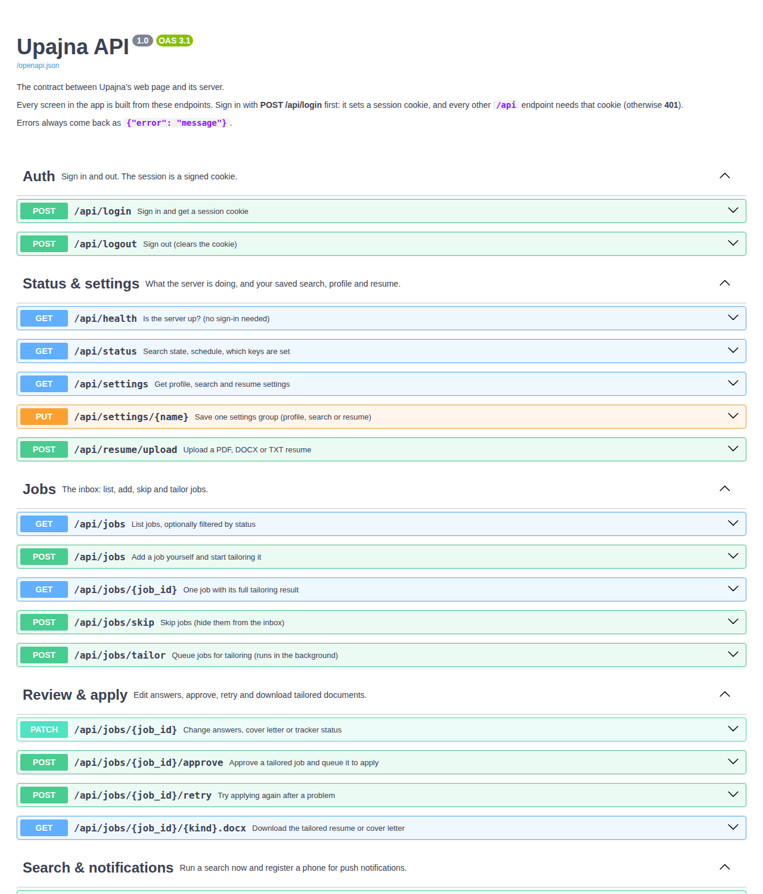

# Step 3: The API contract

In Step 2 the whole look of the app changed, but not one line of server code did. That works because the web page and the server only agree on one thing: **the API**. This step is about that agreement.

## The concept: an API is a contract

Think of a restaurant. The kitchen (server) and the diner (web page) never meet. They only share the **menu**: what you can order, what you must say to order it, and what you get back. The kitchen can change cooks and ovens, and the diner can change tables, as long as the menu stays the same.

An API contract is that menu. For every endpoint it says:

| Part | Example | Meaning |
|---|---|---|
| **Method** (verb) | `POST` | What kind of action |
| **Path** (noun) | `/api/jobs/{job_id}/approve` | Which thing it acts on |
| **Request body** | `{"answers": [...]}` | What you must send |
| **Response** | `{"ok": true, "willSubmit": false}` | What you get back |
| **Status code** | `202` | How it went, in one number |

## REST: nouns in the path, verbs in the method

Upajna follows **REST**, the most common style for web APIs. The idea: paths name *things* (resources), and HTTP methods say what to do with them.

| Method | Means | Safe to repeat? | Upajna example |
|---|---|---|---|
| `GET` | Read | Yes, nothing changes | `GET /api/jobs` lists jobs |
| `POST` | Create, or start an action | No | `POST /api/jobs` adds a job |
| `PUT` | Replace | Yes, same result each time | `PUT /api/settings/profile` saves your profile |
| `PATCH` | Change part of something | Usually | `PATCH /api/jobs/{id}` changes just the tracker status |
| `DELETE` | Remove | Yes | (not used yet; skipping keeps history) |

"Safe to repeat" has a name: **idempotent**. It matters on bad phone signal. If a `PUT` times out, the app can just send it again. If a `POST /approve` times out, sending it twice could apply twice. So `approve` checks the job's current status first:

- job is in `review`: approve it and queue it to apply;
- job is already `ready` or `applying`: answer "ok" again without queuing it a second time (the repeat is harmless);
- job is already `submitted` or anything else: refuse with `409 Conflict`.

Writing this lesson is how we found that guard was missing. Before this step, approving a submitted job twice would have flipped it back to `ready` and applied again. There's now a test for it in `tests/test_api_flow.py`.

Not everything fits neatly. `POST /api/jobs/{id}/approve` and `POST /api/search/run` are **actions**, not things. REST purists would invent a resource for them ("create an approval"), but an action endpoint with a clear verb is easier to read. Being practical here is fine, and worth saying in an interview.

## Status codes: the one-number summary

| Code | Name | When Upajna sends it |
|---|---|---|
| `200` | OK | Normal success |
| `201` | Created | `POST /api/jobs` made a new job |
| `202` | Accepted | "Got it, working on it." Tailoring, searching and applying run in the background |
| `400` | Bad request | You sent something that can't work, like approving with an answer still marked ASK ME |
| `401` | Unauthorized | Not signed in. The web page sees this and shows the sign-in screen |
| `404` | Not found | No job with that id |
| `409` | Conflict | Approving a job that was already submitted |
| `413` | Too large | Resume file over 5 MB |
| `422` | Unprocessable | The body is the wrong shape (FastAPI checks this for you) |

**202 is the important new one.** In Step 1 you saw asynchronous processing: accept fast, work in the background, let the client poll. `202 Accepted` is how the contract *says* that. A client seeing 202 knows not to wait for a finished result.

Errors always have the same shape, `{"error": "a sentence a person can read"}`, so the web page can show any error the same way: `throw new Error(data.error)` in `static/app.js`.

## What we built in this step

The endpoints already existed. What changed is that the contract is now **explicit, documented and tested**.

1. **Self-documenting API.** Every endpoint in `app/main.py` now has a group (tag), a one-line summary and the right status code:

   ```python
   @api.post("/jobs/tailor", tags=["Jobs"],
             summary="Queue jobs for tailoring (runs in the background)",
             status_code=202)
   ```

   FastAPI reads these, plus the Pydantic request models like `NewJob` and `JobPatch`, and generates an **OpenAPI** description of the whole API. You can see it in two forms:
   - `/docs`: an interactive page where you can try every endpoint
   - `/openapi.json`: the same contract as machine-readable JSON (other tools can generate client code from it)

   

2. **A contract test.** `tests/test_contract.py` lists every `(method, path)` that `static/app.js` calls and checks four things:
   - every one of them still exists;
   - every endpoint has a summary and tag, so `/docs` never has a mystery entry;
   - background work answers `202`;
   - every private endpoint answers `401` when you're not signed in.

   If someone renames `/api/jobs/tailor` tomorrow, this test fails in GitHub Actions before the web page breaks. That's the point of a contract: **breaking changes get caught, not discovered.**

## Try it

1. Run the app locally (`uvicorn app.main:app --reload`) and open http://localhost:8000/docs.
2. Open `POST /api/login`, click **Try it out**, enter your password and click **Execute**. The browser now has the session cookie.
3. Open `GET /api/jobs` and click **Execute**. You'll see the same JSON the Inbox is drawn from.
4. Now open `/api/jobs` in a private window, where you aren't signed in. You get `401` and `{"error": ...}`. That's the auth rule from the contract in action.

## Design decisions worth explaining in an interview

- **Why have the server generate the docs instead of writing them by hand?** Hand-written docs drift out of date. Generated docs come from the code, so they're always accurate.
- **Why a contract test when there are already flow tests?** Flow tests check that features work. The contract test checks that the *promise to the client* holds. Once there's a phone app or a second developer, that promise is what lets each side change on its own.
- **Why `/api/...` in every path?** It keeps API routes and web pages apart. Anything under `/api` returns JSON, and everything else returns the web page. Later this also lets a load balancer route them differently.
- **What about versioning?** With one client that ships with the server, there's no need yet. Once other clients exist (say, a mobile app people don't update), you'd move to `/api/v1/...` and keep v1 working while v2 is built.
- **Is `/docs` a security risk on a public server?** It only describes endpoints, and every private one still needs the cookie. Hiding the docs is "security through obscurity". Real protection is auth on every endpoint, which the contract test checks.

## The contract test in action: adding roles

Right after this step, Upajna went from one master resume to **roles**: Business Analyst, Data Engineer and Software / AI-ML Engineer, each with its own job titles and resume. That changed the API:

| Before | After |
|---|---|
| `POST /api/resume/upload` | `POST /api/roles/{role_id}/resume` |
| resume text inside `PUT /api/settings/resume` | `GET /api/roles` and `PUT /api/roles` |
| a job had no role | every job has a `role` field, and `PATCH /api/jobs/{id}` can change it |

The moment the old upload endpoint was renamed, `test_contract.py` failed with "Endpoints the web page needs are gone: /api/resume/upload". That's the test doing its job: the change was **deliberate**, so we updated the web page and the contract together, in the same commit. If it had been an accident, the test would have stopped it before it reached you.

Two other contract details worth noticing:

- **Old data still works.** The first time `GET /api/roles` runs, it turns your old single resume and title list into the Business Analyst role. This is called a **data migration**, and there's a test for it (`test_old_single_resume_becomes_business_analyst_role`).
- **Clear errors.** Tailoring a job whose role has no resume yet returns `400` with "Add your Software / AI-ML Engineer resume in Settings first", not a vague failure.

## Key terms

- **API contract:** the agreed list of endpoints, inputs, outputs and status codes.
- **REST:** paths name resources, and HTTP methods name actions on them.
- **Idempotent:** safe to repeat; doing it twice has the same effect as once.
- **202 Accepted:** the request was taken, and the work happens later.
- **OpenAPI:** a standard JSON format for describing an API, which FastAPI generates automatically.
- **Breaking change:** a change to the contract that makes existing clients fail.

**Next, Step 4: Data modeling.** How jobs are stored, and why a job's status (new → tailoring → review → ready → applying → submitted) is a *state machine*.
