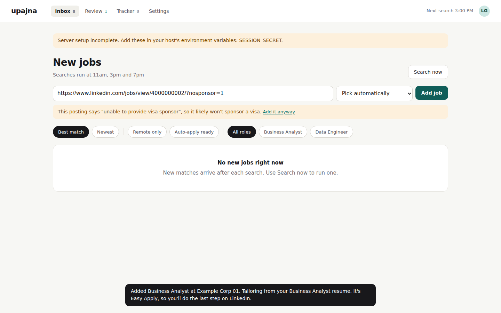

# Side step: Sending jobs to Upajna by link

LinkedIn has the most jobs, but it doesn't offer a public job-search API and doesn't allow bots. So Upajna gets jobs in two ways, depending on what each source allows:

| Source | How jobs get in | Who starts it |
|---|---|---|
| JSearch, Adzuna | Searched 3 times a day through their APIs | Upajna, on a schedule (**pull**) |
| Greenhouse, Lever, Ashby | Read through their official public job APIs | Upajna, when given a link |
| LinkedIn | You send a link; Upajna reads that one public job page | You (**push**) |
| Any other careers page | You send a link; Upajna reads the page's standard job data | You (**push**) |

Upajna never signs in to LinkedIn, never searches it, and never clicks anything there. That respects the site's rules, and it keeps your account safe.

## Concept 1: pull vs push ingestion

Getting data into a system is called **ingestion**, and it comes in two styles:

- **Pull:** the system goes and fetches on its own schedule. Upajna's 11am, 3pm and 7pm searches are pull.
- **Push:** something outside sends data in when it happens. A link you paste, the bookmark button, and the Android Share menu are all push.

Real systems usually need both. Pull covers the sources you're allowed to poll; push covers everything else, and it's instant.

## Concept 2: one adapter per site, one shape out

Every site describes jobs differently: LinkedIn's page HTML, Greenhouse's JSON, Lever's JSON with lists, careers pages with schema.org data. `app/search/links.py` has a small reader for each, and every reader returns the **same shape**:

```python
@dataclass
class LinkJob:
    title: str; company: str; location: str; jd: str
    applyUrl: str        # where the application really happens
    applyVia: str        # "easy_apply" or "company_site"
```

This is the **adapter pattern**: messy, different inputs on one side, one clean interface on the other. Everything after it (the sponsorship check, choosing a resume, tailoring, applying) works the same no matter where the job came from. Adding a new site means writing one more adapter, and nothing else changes.

The readers are **pure functions** (`parse_linkedin(html)`, `parse_greenhouse(json)`): text in, `LinkJob` out, with no network inside. That's why `tests/test_links.py` can check every site using saved sample pages, without touching the internet.

## Concept 3: fail gracefully, never silently

Sometimes LinkedIn won't show a page to a server, or a careers page has nothing readable. Instead of failing, the API answers:

```
422  {"error": "LinkedIn didn't show this job to Upajna. Paste the job description below...", "needsText": true}
```

The page sees `needsText`, opens a box, and you paste the description. The job carries on through the same pipeline. A fallback path that keeps the user moving is called **graceful degradation**.

Two more answers worth knowing:

- `409 Conflict` with `blocked`: the posting says it won't sponsor. You see the exact phrase and can choose **Add it anyway** (the request is resent with `force: true`).
- `200` with `duplicate: true`: you already sent this job. Sending it twice is harmless; that's idempotency again (Step 3).

## Concept 4: the API has more than one client now

Until now, only Upajna's own web page called the API. Now there are three more callers:

1. **The paste box** in the Inbox: the original client.
2. **The bookmark button** ("bookmarklet"): a bookmark whose address is a tiny piece of JavaScript. Clicked on any job page, it opens `upajna/#add=<that page's address>`.
3. **Android's Share menu:** `manifest.webmanifest` declares a `share_target`, so the installed app appears in the Share menu. Sharing opens `upajna/?url=…&text=…`.

All three end in the same `POST /api/jobs`. That's the payoff of having a clear API contract: new ways in cost a few lines each, because the server logic is shared.



## Easy Apply vs company site

LinkedIn jobs come in two kinds, and Upajna works out which one from the page:

- **"Apply" on the company website:** the page contains the company's real application link. If it's Greenhouse, Lever or Ashby, Upajna fills the form for you after you approve.
- **Easy Apply:** the form only exists inside your LinkedIn account. Upajna tailors everything, then moves the job to **Needs you**, with your resume to download and your answers ready to copy. You click Easy Apply and paste.

## Try it

1. Copy a LinkedIn job link and paste it into the box at the top of the Inbox.
2. Watch it arrive in Review with a role, score and tailored resume, and see whether it's marked Easy Apply.
3. In Settings, under **Send jobs to Upajna**, drag the button to your bookmarks bar, then click it on any job page.

## Key terms

- **Ingestion:** getting data into a system. **Pull** means the system fetches it; **push** means someone sends it.
- **Adapter pattern:** a small translator per source, so the rest of the system sees one shape.
- **Pure function:** output depends only on input; no network or database inside. Easy to test.
- **Graceful degradation:** when the best path fails, fall back to a simpler path instead of failing.
- **Bookmarklet:** a bookmark that runs a little JavaScript on the page you're viewing.
- **Web share target:** a manifest setting that puts an installed web app in the phone's Share menu.
