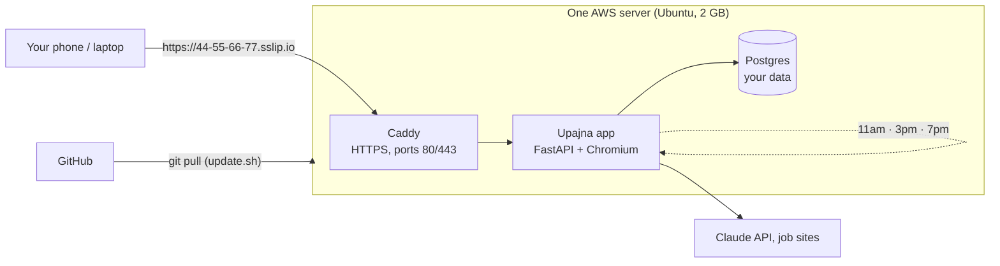

# Step 7: Deployment on AWS

Until now Upajna ran on a laptop or inside tests. Deployment means putting it on a computer that is **always on and reachable from the internet**, so the 11am, 3pm and 7pm searches happen while your laptop is closed, and your phone can open it anywhere.

## The picture



Three **containers** run on one **server**, started together by **Docker Compose**:

| Container | Job | Why it's separate |
|---|---|---|
| `caddy` | Answers on ports 80/443, gets a free HTTPS certificate, passes requests to the app | Security and certificates are a job of their own; the app never deals with them |
| `app` | The Upajna server you've been building (built from the `Dockerfile`) | The thing you update most often |
| `db` | Postgres 16, storing jobs, roles and settings | Data must survive app updates; it lives on its own **volume** |

## Concepts

**Server (virtual machine).** A computer in an AWS data center that you rent by the month. Lightsail is AWS's simple version: fixed price, a few clicks. EC2 is the flexible version with many more options.

**Image vs container.** The `Dockerfile` is a recipe. Building it makes an **image** (a frozen package: Python, Chromium, Upajna's code). Running an image makes a **container**. Updating Upajna means building a new image and replacing the container; your data isn't inside it, so nothing is lost.

**Volume.** A folder that lives outside any container (`db-data`, `caddy-data`). Postgres writes there, so deleting or rebuilding containers never deletes your jobs.

**Reverse proxy.** Caddy sits in front of the app. The internet only ever talks to Caddy; the app's port 8000 isn't exposed at all (`expose`, not `ports`, in `docker-compose.yml`). This is the same pattern big sites use with Nginx or a load balancer.

**HTTPS and certificates.** HTTPS encrypts traffic between your phone and the server, so your password and resume can't be read on public Wi-Fi. It needs a **certificate** proving the server owns its address. Caddy gets one from Let's Encrypt for free and renews it automatically. Phones also *require* HTTPS before they'll install an app to the home screen or allow notifications.

**DNS and sslip.io.** Certificates are issued to names, not raw IP addresses. Normally you'd buy a domain (`upajna.com`, about $12/year) and point it at the server. `sslip.io` is a free service where the name contains the IP: `44-55-66-77.sslip.io` always points to `44.55.66.77`. That gives a real name, and a real certificate, for free. You can switch to your own domain later by changing `DOMAIN` in `.env`.

**Static IP.** A server's public IP can change if it's stopped and started. A static IP stays fixed, which matters because your address (and certificate) are built from it.

**Firewall.** Rules for which doors (ports) are open: 22 for SSH (the admin terminal), 80 for HTTP (needed once to get the certificate), 443 for HTTPS. Everything else stays closed, including Postgres.

**Secrets.** Your password, Claude key and database password live only in `~/upajna/.env` on the server, readable only by your user (`chmod 600`), never in GitHub and never inside an image (`.dockerignore` excludes it). `setup.sh` generates the random ones (session secret, database password, notification keys) so you never have to.

**Idempotent setup.** `setup.sh` can be run again safely: it keeps the existing `.env`, doesn't add duplicate keys or duplicate backup schedules, and just rebuilds. (We tested exactly that before shipping it.)

**Backups.** Every night at 3:30am, and before every update, `backup.sh` saves a compressed copy of the database to `~/backups`, keeping the last 14. Restoring is one command (written at the top of `backup.sh`).

## How it was tested before touching AWS

- **Postgres:** the whole test suite now runs on real Postgres 16 as well as SQLite (`TEST_DATABASE_URL`). GitHub Actions does both on every push, and also checks that the Docker image builds.
- **Production mode:** the app was started with real settings against Postgres; sign-in behind HTTPS sets a `Secure` cookie, and the database tables are created on first start.
- **setup.sh rehearsal:** the script was run end to end with stand-ins for Docker, sudo and the network. It caught two real bugs before they could happen on your server: one variable that isn't always set, and a scheduling step that would have stopped the script on a brand-new server.
- **Tricky passwords:** a password with `$`, `#` and spaces goes into `.env` and reaches the app unchanged.

## Doing it: AWS step by step

**Before you start:** your Claude API key ready (it starts with `sk-ant-`). Job-search keys are optional.

### A. Create the server (Lightsail)

1. In the AWS console search bar, type **Lightsail** and open it.
2. Click **Create instance**.
3. **Region:** keep **Oregon (us-west-2)**, the closest to Los Angeles.
4. **Platform:** Linux/Unix. **Blueprint:** choose **OS Only**, then **Ubuntu 24.04 LTS**.
5. **Plan:** the **2 GB memory** plan. (Chromium, which fills application forms, needs the memory; the 512 MB and 1 GB plans are too small.)
6. **Name:** `upajna`. Click **Create instance**. Wait until it says **Running** (about a minute).

### B. Give it a fixed address

1. In Lightsail, open the **Networking** tab at the top, then **Create static IP**.
2. Attach it to `upajna`, name it `upajna-ip`, click **Create**. Note the IP address.

### C. Open the HTTPS door

1. Open your `upajna` instance, then its **Networking** tab.
2. Under **IPv4 Firewall**, you'll see SSH (22) and HTTP (80). Click **Add rule**, choose **HTTPS**, and save.

### D. Run the setup

1. On the instance, open the **Connect** tab and click **Connect using SSH**. A black terminal opens in your browser.
2. Paste this and press Enter:
   ```bash
   bash <(curl -fsSL https://raw.githubusercontent.com/GnanithaG/Upajna/main/deploy/setup.sh)
   ```
3. Answer the questions:
   - a password for signing in to Upajna (12+ characters; typing is hidden),
   - your Claude API key (paste; hidden),
   - job-search keys (press Enter to skip),
   - your email,
   - the web address (press Enter to accept the suggested `…sslip.io` one).
4. Wait about 5–10 minutes while it builds. It ends with **Upajna is live: https://…sslip.io**.

### E. Use it

1. Open that address on your laptop and phone, and sign in.
2. Phone: **Share → Add to Home Screen** (iPhone) or **⋮ → Install app** (Android).
3. **Settings → Roles and resumes:** upload your three resumes. Fill in **My details**. Tap **Turn on notifications**.

### If Lightsail isn't available on your account

The AWS Free plan only includes "select" services. If Lightsail says it's not available, use EC2, AWS's regular servers, which are included (and launching one earns one of the credit activities):

1. EC2 → **Launch instance** → Ubuntu Server 24.04 → instance type **t3.small** (2 GB).
2. Key pair: create one (or proceed without and use **EC2 Instance Connect**).
3. Network settings: allow **SSH**, **HTTP** and **HTTPS** from the internet.
4. Storage: 20 GB. Launch.
5. **Elastic IPs → Allocate → Associate** with the instance.
6. Connect with **EC2 Instance Connect** and run the same setup command as in step D.

## Day-to-day

| You want to | Do this on the server |
|---|---|
| Get the newest version after pushing to GitHub | `~/upajna/deploy/update.sh` |
| Turn on real submission | Edit `~/upajna/.env` (`nano ~/upajna/.env`), set `APPLY_SUBMIT=true`, then run `update.sh` |
| See what the app is doing | `sudo docker compose --env-file ~/upajna/.env -f ~/upajna/deploy/docker-compose.yml logs --tail 100 app` |
| Make a backup now | `~/upajna/deploy/backup.sh` |

## Cost and the Free plan

- The 2 GB Lightsail plan or an EC2 t3.small is roughly $12–17 a month. AWS credits pay for it, so check **Billing → Credits** after the first day to see the real rate.
- On the **Free plan**, the account closes after six months or when credits run out, whichever comes first, and resources are deleted 90 days later. Before then, upgrade to the Paid plan (any remaining credits carry over) or download a backup.
- Your `upajna-monthly` budget alert ($10) will email you if spending goes over, so you'll know early.

## Interview questions this answers

- **Why one server instead of ECS or Kubernetes?** One user, one instance, a predictable load. A single VM with Compose is the simplest thing that works, costs the least, and is easy to reason about. Step 8 covers what changes with many users (multiple app instances, a managed database, a separate scheduler).
- **What happens when the server restarts?** Every container has `restart: unless-stopped`, so Docker brings them all back. Jobs that were mid-tailoring are picked up again from their saved status (`resume_queues()`).
- **Where would this break first?** Memory: Chromium is the hungriest part. That's why the plan is 2 GB, `shm_size` is set, and the script adds 2 GB of swap.
- **How do you keep secrets out of Git?** `.env` lives only on the server, is listed in `.gitignore` and `.dockerignore`, and is readable only by its owner.

## Key terms

- **VM / instance:** a rented computer in the cloud.
- **Image / container:** the built package / a running copy of it.
- **Volume:** storage that outlives containers.
- **Reverse proxy:** the front door that forwards requests to the app.
- **TLS certificate:** proof of identity that makes HTTPS possible.
- **Static IP:** an address that doesn't change.
- **Firewall rule:** which ports are reachable from the internet.
- **Idempotent script:** safe to run more than once.
